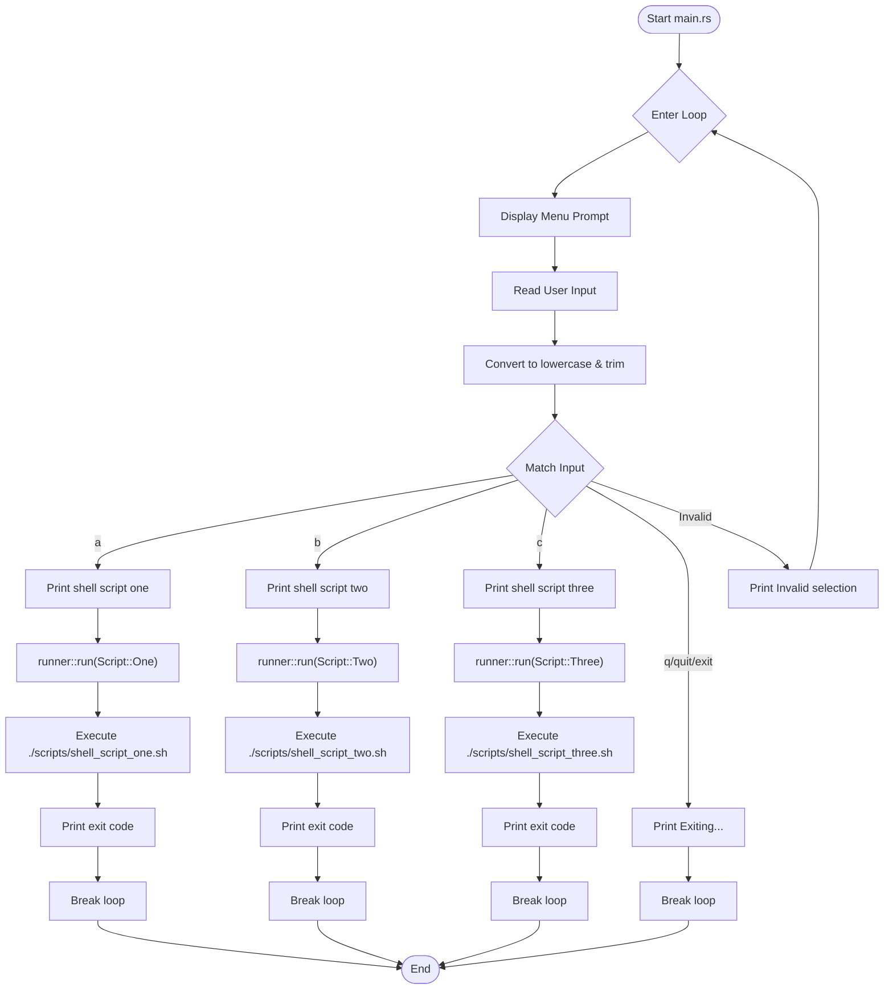

# Menu Run

**A simple Rust application that presents an interactive menu and executes shell scripts based on user selection.**

## Execution Flow

When the program starts (`cargo run`), the following execution flow occurs:



### Detailed Flow Description

1. **Program Start**: The `main()` function in `src/main.rs` begins execution.

2. **Interactive Loop**: The program enters an infinite loop that:
   - Displays a menu prompt asking for user selection (A, B, C, or Q/quit/exit)
   - Flushes stdout to ensure the prompt is immediately visible

3. **User Input Processing**:
   - Reads a line from stdin
   - Trims whitespace and converts to lowercase for case-insensitive matching
   - If reading fails, displays an error and continues the loop

4. **Input Matching**:
   - **Option A**: Prints "shell script one", calls `runner::run(Script::One)`, breaks loop
   - **Option B**: Prints "shell script two", calls `runner::run(Script::Two)`, breaks loop
   - **Option C**: Prints "shell script three", calls `runner::run(Script::Three)`, breaks loop
   - **Quit (q/quit/exit)**: Prints "Exiting...", breaks loop
   - **Invalid input**: Prints error message, continues loop

5. **Script Execution** (via `src/runner.rs`):
   - The `run()` function receives a `Script` enum variant
   - Maps the variant to corresponding script path:
     - `Script::One` → `./scripts/shell_script_one.sh`
     - `Script::Two` → `./scripts/shell_script_two.sh`
     - `Script::Three` → `./scripts/shell_script_three.sh`
   - Spawns a bash process with the script path as argument
   - Captures and prints the exit code
   - Returns the exit code wrapped in `Result<i32>`

6. **Program Termination**: After breaking the loop, prints a blank line and exits.

## Prerequisites

- Rust toolchain (edition 2024)
- Bash shell
- Execute permissions on shell scripts: `chmod +x scripts/*.sh`

## Usage

```bash
# Build the project
cargo build

# Run the application
cargo run
```
