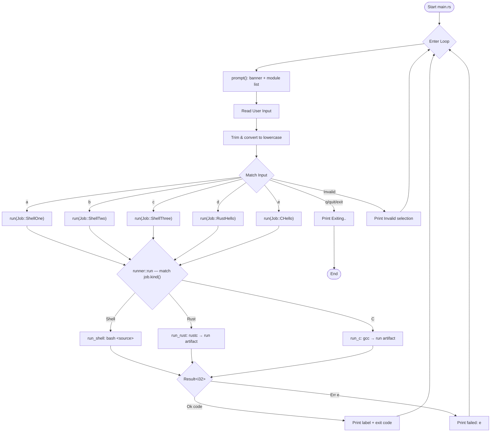

# Menu Run

`menu_run` is a small Rust command-line menu application for running a fixed set of allow listed local modules.

It provides a simple terminal menu that lets the user select predefined jobs, such as shell scripts, a Rust module, or a C module. 
The Rust application owns the menu loop and dispatches each selection to a runner that executes the corresponding module.

## What This Project Does

This project is a command menu for running local code from one place.

Currently supported module types:

- Shell scripts
- Rust source files compiled with `rustc`
- C source files compiled with `gcc`

The program presents a menu, accepts a short user selection, maps that selection to a known job, and runs only that allowlisted job.

Example menu options include:

- Run shell module one
- Run shell module two
- Run shell module three
- Compile and run a Rust module
- Compile and run a C module
- Quit the program

## Project Structure
```
text
menu_run/
├── docs/
│   └── project documentation and planning notes
├── modules/
│   ├── build/
│   │   └── compiled output artifacts
│   ├── c/
│   │   └── C modules
│   ├── rust/
│   │   └── Rust modules
│   └── shell/
│       └── shell script modules
├── src/
│   ├── banner.rs
│   ├── jobs.rs
│   ├── main.rs
│   └── runner.rs
├── Cargo.lock
├── Cargo.toml
└── README.md
```
## Main Components

### `src/main.rs`

Owns the interactive menu loop.

Responsibilities:

- Print the prompt and menu.
- Read user input from standard input.
- Convert menu selections into known jobs.
- Call the runner.
- Print success or failure messages.

This module should not build filesystem paths or spawn processes directly.

### `src/banner.rs`

Owns presentation-only output.

Responsibilities:

- Print the command menu banner.
- Print the list of selectable modules.

### `src/jobs.rs`

Defines the allowlisted jobs that the application is allowed to run.

Responsibilities:

- Define the closed set of runnable jobs.
- Assign labels to jobs.
- Define each job's execution strategy.
- Define source paths for each module.
- Define artifact paths for compiled modules.

The `Job` enum is the allowlist. Menu input maps to one of these fixed variants rather than to an arbitrary user-provided path.

### `src/runner.rs`

Owns process execution.

Responsibilities:

- Run shell modules with `bash`.
- Compile Rust modules with `rustc`.
- Compile C modules with `gcc`.
- Execute compiled artifacts.
- Return process exit codes.
- Report infrastructure errors, such as missing source files or failed process startup.

## Modules

### Shell Modules

Shell modules live under:
```
modules/shell/
```
They are run using Bash.

Example files:
```
modules/shell/one.sh
modules/shell/two.sh
modules/shell/three.sh
```
### Rust Modules

Rust modules live under:
```
modules/rust/
```
A Rust module is compiled with `rustc` and then executed.

Example file:
```
modules/rust/hello.rs
```
Compiled output is written under:
```
modules/build/
```
### C Modules

C modules live under:
```
modules/c/
```
A C module is compiled with `gcc` and then executed.

Example file:
```
modules/c/hello.c
```
Compiled output is written under:
```
modules/build/
```
## Security Model

This project uses an allowlist-based execution model.

Instead of accepting arbitrary commands or paths from the user, menu input is mapped to fixed `Job` enum variants. Each job defines its own known source path.

This helps avoid common command-injection patterns such as building shell command strings from user input.

However, this project is **not a sandbox**.

Important security notes:

- The program intentionally executes local scripts and compiled programs.
- Anyone who can modify files under `modules/` can influence what the menu runs.
- Shell, Rust, and C modules run with the permissions of the current user.
- Do not run untrusted modules with this tool.
- Do not run this program as `root` or administrator.
- Protect `modules/`, `modules/build/`, and source files from untrusted writes.
- See `docs/SECURITY_TODO.md` for a hardening checklist.

## Requirements

Required tools depend on which module types you want to run:

- Rust toolchain and Cargo
- Bash for shell modules
- `rustc` for Rust modules
- `gcc` for C modules


## Execution Flow

When the program starts (`cargo run`), the following execution flow occurs:


```mermaid
flowchart TD
    Start([Start main.rs]) --> Loop{Enter Loop}
    Loop --> Prompt["prompt(): banner + module list"]
    Prompt --> Input[Read User Input]
    Input --> Parse[Trim &amp; convert to lowercase]
    Parse --> Match{Match Input}

    Match -->|a| JobA["run(Job::ShellOne)"]
    Match -->|b| JobB["run(Job::ShellTwo)"]
    Match -->|c| JobC["run(Job::ShellThree)"]
    Match -->|d| JobD["run(Job::RustHello)"]
    Match -->|e| JobE["run(Job::CHello)"]
    Match -->|q/quit/exit| Exit[Print Exiting..]
    Match -->|Invalid| Invalid[Print Invalid selection]

    JobA --> Dispatch{"runner::run — match job.kind()"}
    JobB --> Dispatch
    JobC --> Dispatch
    JobD --> Dispatch
    JobE --> Dispatch

    Dispatch -->|Shell| Shell["run_shell: bash &lt;source&gt;"]
    Dispatch -->|Rust| Rust["run_rust: rustc → run artifact"]
    Dispatch -->|C| CLang["run_c: gcc → run artifact"]

    Shell --> Result{"Result&lt;i32&gt;"}
    Rust --> Result
    CLang --> Result

    Result -->|Ok code| PrintCode["Print label + exit code"]
    Result -->|Err e| PrintErr["Print failed: e"]

    PrintCode --> Loop
    PrintErr --> Loop
    Invalid --> Loop

    Exit --> End([End])

```

### Detailed Flow Description

1. **Program Start**: The `main()` function in `src/main.rs` begins execution.

2. **Interactive Loop**: The program enters an infinite loop. Each iteration calls
   `prompt()`, which:
   - Prints the menu line asking for a selection (A, B, C, D, E, or Q/quit/exit)
   - Flushes stdout so the prompt is immediately visible
   - Prints the banner (`banner::print_banner`) and the module list (`banner::print_modules`)

3. **User Input Processing**:
   - Reads a line from stdin
   - Trims whitespace and converts to lowercase for case-insensitive matching
   - If reading fails, displays an error and continues the loop

4. **Input Matching**: Each menu key maps to a `Job` variant and calls `runner::run`:
   - **Option A**: `Job::ShellOne`
   - **Option B**: `Job::ShellTwo`
   - **Option C**: `Job::ShellThree`
   - **Option D**: `Job::RustHello`
   - **Option E**: `Job::CHello`
   - **Quit (q/quit/exit)**: Prints "Exiting..", breaks the loop
   - **Invalid input**: Prints "Invalid selection.", continues the loop

   After a job runs, `main` prints the job's label with its exit code (on `Ok`)
   or a failure message (on `Err`), then loops back to the prompt. Running a job
   does **not** exit the program — only `q`/`quit`/`exit` breaks the loop.

5. **Job Execution** (via `src/runner.rs`):
   - `run()` receives a `Job` and dispatches on `job.kind()` (`JobKind`):
     - `JobKind::Shell` → `run_shell`: runs `bash <source_path>`
     - `JobKind::Rust` → `run_rust`: compiles the source with `rustc -o <artifact>`, then executes the artifact
     - `JobKind::C` → `run_c`: compiles the source with `gcc -o <artifact>`, then executes the artifact
   - Source and artifact paths come from the `Job` definition in `src/jobs.rs`,
     rooted at `CARGO_MANIFEST_DIR` (e.g. `modules/shell/shell_script_one.sh`,
     `modules/rust/hello.rs` → `modules/build/hello_rs`).
   - For compiled jobs, the build directory is created if needed. If compilation
     fails, the compiler's exit code is returned without running the artifact.
   - Returns the exit code wrapped in `io::Result<i32>`.

6. **Program Termination**: When `q`/`quit`/`exit` breaks the loop, `main` returns `Ok(())` and the program exits.

## Prerequisites

- Rust toolchain (edition 2024)
- Bash shell
- Execute permissions on shell scripts: `chmod +x scripts/*.sh`

## Usage

From the project root:
```bash

# Run the application
cargo run
```

Then choose one of the displayed menu options.

Example:
```
a
```
runs the first shell module.
```
d
```
compiles and runs the Rust module.
```
e
```
compiles and runs the C module.

To quit:
```
q
```
or:
```
quit
```
or:
```
exit
```
## Adding a New Module

To add a new module, update the project in three places:

1. Add the module file under the appropriate `modules/` subdirectory.
2. Add a new `Job` variant in `src/jobs.rs`.
3. Map a menu key to that job in `src/main.rs`.

Depending on the module type, also ensure the job returns the correct `JobKind`:

- `JobKind::Shell`
- `JobKind::Rust`
- `JobKind::C`

For compiled modules, add an artifact path under `modules/build/`.

## Error Handling

The runner distinguishes between infrastructure errors and process exit codes.

Examples of infrastructure errors:

- Source file is missing.
- Compiler cannot be started.
- Build directory cannot be created.
- Compiled artifact cannot be executed.

These are returned as `io::Result` errors.

If a child process runs but exits with a non-zero status, the runner returns that exit code successfully. This allows the menu to report that the process ran, even if the process itself failed.

## Development Notes

The codebase is intentionally split by responsibility:

- `main.rs` handles user interaction.
- `banner.rs` handles display text.
- `jobs.rs` defines what can run.
- `runner.rs` defines how jobs run.

This separation keeps menu logic, job definitions, and process execution independent from each other.

## Current Status

This is a small local command-menu prototype with support for:

- Three shell script modules
- One Rust module
- One C module

Future improvements may include:

- More modules
- Better formatting of menu output
- Path canonicalization checks
- Environment hardening
- Execution timeouts
- More structured logging
- Tests for job mapping and runner behavior


